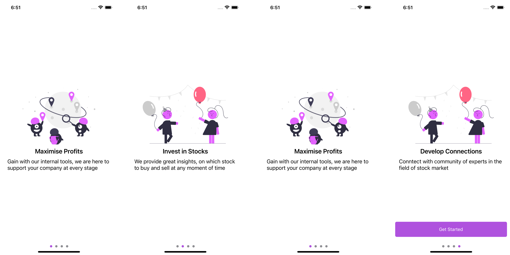

# SVSwiper Onboarding iOS Library


SVSwiper library uses core UIKit components and provides custom onBoarding screens with many customisation options. SVSwiper provides various delegate methods to customise the navigation according the needs of application. Any contributions towards this library are welcome. 

[](https://cocoapods.org/pods/SVSwiper)
[](https://swift.org)
[](https://developer.apple.com/ios/)
[](LICENSE)
[](https://developer.apple.com/documentation/bundleresources/privacy-manifest-files)

## Features

✨ **Easy Integration** - Simple API with just a few lines of code  
🎨 **Customizable** - Customize colors, fonts, and content  
📱 **Modern Design** - Beautiful horizontal scrolling onboarding screens  
🔒 **Type Safe** - Fully written in Swift with value types  
🧪 **Tested** - Comprehensive unit test coverage  
🎯 **Delegate Pattern** - Modern coordinator delegate for better control  
🦋 **SwiftUI Support** - Native SwiftUI views for iOS 14+ with result builders  
🔐 **Privacy Manifest** - Includes PrivacyInfo.xcprivacy for App Store compliance  

## Requirements

- iOS 14.0+
- Swift 5.3+
- Xcode 12.0+

## Installation

### Swift Package Manager (Recommended)

SVSwiper is available through [Swift Package Manager](https://swift.org/package-manager/).

To add SVSwiper as a dependency to your Xcode project, select File > Swift Packages > Add Package Dependency and enter the repository URL:

```
https://github.com/sareenv/SVSwiper.git
```

Alternatively, you can add it to your `Package.swift` file:

```swift
dependencies: [
    .package(url: "https://github.com/sareenv/SVSwiper.git", from: "2.1.0")
]
```

Then add `SVSwiper` to your target dependencies:

```swift
targets: [
    .target(
        name: "YourTarget",
        dependencies: ["SVSwiper"]
    )
]
```

### CocoaPods

SVSwiper is also available through [CocoaPods](https://cocoapods.org). To install it, simply add the following line to your Podfile:

```ruby
pod 'SVSwiper'
```

## Usage

### SwiftUI

For modern SwiftUI apps, use the native `SVSwiperView` with **ultra-simple syntax**:

#### Minimal Setup (Just Pass the Array!)

```swift
import SwiftUI
import SVSwiper

struct ContentView: View {
    @State private var showOnboarding = !UserDefaults.standard.bool(forKey: "isOpenedBefore")
    
    var body: some View {
        if showOnboarding {
            // Just pass your content array! ✨
            SVSwiperView([
                SVContent(title: "Welcome", description: "Get started", image: UIImage(named: "onboarding1")),
                SVContent(title: "Discover", description: "Explore features", image: UIImage(named: "onboarding2")),
                SVContent(title: "Get Started", description: "You're all set!", image: UIImage(named: "onboarding3"))
            ]) {
                showOnboarding = false
            }
        } else {
            MainAppView()
        }
    }
}
```

#### Result Builder Syntax (SwiftUI-Native DSL)

For a more declarative approach, use the result builder:

```swift
struct ContentView: View {
    @State private var showOnboarding = true
    
    var body: some View {
        if showOnboarding {
            SVSwiperView {
                SVContent(
                    title: "Welcome",
                    description: "Get started with our amazing app",
                    image: UIImage(named: "onboarding1")
                )
                SVContent(
                    title: "Discover",
                    description: "Explore all the features",
                    image: UIImage(named: "onboarding2")
                )
                SVContent(
                    title: "Get Started",
                    description: "You're all set!",
                    image: UIImage(named: "onboarding3")
                )
            } onComplete: {
                withAnimation {
                    showOnboarding = false
                }
            }
        } else {
            MainAppView()
        }
    }
}
```

#### Advanced Customization

```swift
struct ContentView: View {
    @State private var showOnboarding = true
    
    let contents = [
        SVContent(title: "Maximise Profits", description: "Gain with our internal tools", image: UIImage(named: "onboarding1")),
        SVContent(title: "Invest in Stocks", description: "We provide great insights", image: UIImage(named: "onboarding2")),
        SVContent(title: "Develop Connections", description: "Connect with experts", image: UIImage(named: "onboarding3"))
    ]
    
    var body: some View {
        if showOnboarding {
            SVSwiperView(
                contents,
                backgroundColor: Color(uiColor: .systemBackground),
                titleFont: .custom("YourFont-Bold", size: 28),
                descriptionFont: .custom("YourFont-Regular", size: 17),
                buttonColor: .blue,
                buttonTitle: "Let's Go!"
            ) {
                withAnimation {
                    showOnboarding = false
                }
            }
            .transition(.move(edge: .leading))
        } else {
            TabView {
                HomeView()
                    .tabItem { Label("Home", systemImage: "house") }
            }
        }
    }
}
```

#### Multiple Initialization Options

```swift
// 1. Simplest - Just the array
SVSwiperView(contents) { }

// 2. With customization
SVSwiperView(contents, backgroundColor: .blue, buttonColor: .green) { }

// 3. Result builder (DSL style)
SVSwiperView {
    SVContent(title: "Screen 1", description: "Description", image: nil)
    SVContent(title: "Screen 2", description: "Description", image: nil)
} onComplete: { }

// 4. Full customization with result builder
SVSwiperView(
    backgroundColor: .white,
    titleFont: .largeTitle,
    descriptionFont: .body,
    buttonColor: .purple,
    buttonTitle: "Start Now"
) {
    SVContent(title: "Welcome", description: "Let's begin", image: nil)
    SVContent(title: "Features", description: "Discover more", image: nil)
} onComplete: {
    print("Completed!")
}
```

### UIKit - Modern Coordinator Pattern (Recommended)

The modern approach uses a coordinator delegate pattern for better control over navigation:

```swift
import UIKit
import SVSwiper

class AppCoordinator: SVSwiperCoordinatorDelegate {
    private let window: UIWindow
    
    init(window: UIWindow) {
        self.window = window
    }
    
    func start() {
        let onboardingController = createOnboardingController()
        
        if onboardingController.shouldShowOnboarding() {
            window.rootViewController = onboardingController
        } else {
            showMainApp()
        }
        
        window.makeKeyAndVisible()
    }
    
    private func createOnboardingController() -> SVSwiperController {
        let data: [SVContent] = [
            SVContent(
                title: "Maximise Profits",
                description: "Gain with our internal tools, we are here to support your company at every stage",
                image: UIImage(named: "onboarding1")
            ),
            SVContent(
                title: "Invest in Stocks",
                description: "We provide great insights, on which stock to buy and sell at any moment of time",
                image: UIImage(named: "onboarding2")
            ),
            SVContent(
                title: "Develop Connections",
                description: "Connect with community of experts in the field of stock market",
                image: UIImage(named: "onboarding3")
            )
        ]
        
        let controller = SVSwiperController(
            backgroundColor: .white,
            details: data,
            titleFont: .boldSystemFont(ofSize: 24),
            descriptionFont: .systemFont(ofSize: 16)
        )
        
        controller.coordinatorDelegate = self
        return controller
    }
    
    // MARK: - SVSwiperCoordinatorDelegate
    
    func swiperDidComplete(_ controller: SVSwiperController) {
        showMainApp()
    }
    
    func swiperShouldShow(_ controller: SVSwiperController) -> Bool {
        return controller.shouldShowOnboarding()
    }
    
    func swiper(_ controller: SVSwiperController, didScrollToPage page: Int) {
        print("User scrolled to page: \(page)")
    }
    
    private func showMainApp() {
        let mainViewController = MainViewController()
        window.rootViewController = UINavigationController(rootViewController: mainViewController)
    }
}
```

### In SceneDelegate or AppDelegate

```swift
// In SceneDelegate
func scene(_ scene: UIScene, willConnectTo session: UISceneSession, options connectionOptions: UIScene.ConnectionOptions) {
    guard let windowScene = (scene as? UIWindowScene) else { return }
    let window = UIWindow(windowScene: windowScene)
    self.window = window
    
    let coordinator = AppCoordinator(window: window)
    coordinator.start()
}
```

### UIKit - Legacy Approach (Deprecated)

The library still supports the legacy approach for backward compatibility:

```swift
import UIKit
import SVSwiper

class ViewController: UIViewController {
    
    private let data: [SVContent] = [
        SVContent(title: "Maximise Profits", description: "Gain with our internal tools", image: UIImage(named: "onboarding1")),
        SVContent(title: "Invest in Stocks", description: "We provide great insights", image: UIImage(named: "onboarding2")),
        SVContent(title: "Develop Connections", description: "Connect with community of experts", image: UIImage(named: "onboarding3"))
    ]
        
    override func viewWillAppear(_ animated: Bool) {
        super.viewWillAppear(animated)
        setupSVSwiper()
    }
    
    private func setupSVSwiper() {
        let controller = SVSwiperController(
            backgroundColor: .white,
            details: data,
            descriptionFont: .systemFont(ofSize: 13)
        )
        let parentController = MainViewController()
        controller.configureSlider(parentViewController: parentController, isNavigationSupported: true)
    }
}
```

## Privacy Manifest

SVSwiper includes a `PrivacyInfo.xcprivacy` file that declares:

- **No Tracking**: The library does not track users
- **No Data Collection**: No personal data is collected
- **UserDefaults API Usage**: Documents the use of UserDefaults for storing onboarding completion status (Reason: CA92.1 - Storing user preferences)

This ensures compliance with Apple's App Privacy requirements for iOS 17+ and App Store submissions.

### What's Declared

```xml
NSPrivacyAccessedAPITypes:
  - NSPrivacyAccessedAPICategoryUserDefaults
    Reasons: CA92.1 (Accessing user defaults to read/write onboarding completion status)
```

## Customization

### SVContent

Create content for each onboarding screen:

```swift
let content = SVContent(
    title: "Your Title",
    description: "Your description text",
    image: UIImage(named: "yourImage") // Optional
)
```

### SVSwiperController (UIKit)

Customize the appearance:

```swift
let controller = SVSwiperController(
    backgroundColor: .systemBackground,  // Background color
    details: contentArray,                // Array of SVContent
    titleFont: .boldSystemFont(ofSize: 24),  // Title font
    descriptionFont: .systemFont(ofSize: 16)  // Description font
)
```

### SVSwiperView (SwiftUI)

Customize the SwiftUI view with multiple initialization options:

```swift
// Simple - just pass the array
SVSwiperView(contentArray) { }

// With customization
SVSwiperView(
    contentArray,
    backgroundColor: .white,
    titleFont: .system(size: 24, weight: .bold),
    descriptionFont: .system(size: 16),
    buttonColor: .purple,
    buttonTitle: "Get Started"
) {
    // Completion handler
}

// Result builder syntax
SVSwiperView {
    SVContent(title: "Screen 1", description: "Text", image: nil)
    SVContent(title: "Screen 2", description: "Text", image: nil)
} onComplete: {
    // Completion handler
}
```

## Testing

To reset the onboarding status (useful for testing):

```swift
// UIKit
let controller = SVSwiperController(backgroundColor: .white, details: data)
controller.resetOnboardingStatus()

// SwiftUI
UserDefaults.standard.removeObject(forKey: "isOpenedBefore")
```

To check if onboarding should be shown:

```swift
// UIKit
if controller.shouldShowOnboarding() {
    // Show onboarding
} else {
    // Show main app
}

// SwiftUI
@State private var showOnboarding = !UserDefaults.standard.bool(forKey: "isOpenedBefore")
```

## Migration Guide (v2.0 → v2.1)

### Breaking Changes

1. **SVContent is now a struct** (was a class)
   - This improves thread safety and follows Swift best practices
   - No code changes required unless you were subclassing (not recommended)

2. **Property names updated**
   - `svTitle` → `title`
   - `svDescription` → `description`
   - `svImage` → `image`
   - Old property names still work but are deprecated

### New Features

1. **SwiftUI Support** - Native SwiftUI views with result builders for iOS 13+
2. **Privacy Manifest** - Includes PrivacyInfo.xcprivacy for App Store compliance
3. **Modern Coordinator Pattern** - Better separation of concerns
4. **Result Builder API** - SwiftUI-native DSL for declaring content

### Recommended Updates

1. **Use coordinator delegate pattern** instead of `configureSlider`:

```swift
// Old (still works, but deprecated)
controller.configureSlider(parentViewController: mainVC, isNavigationSupported: true)

// New (recommended)
controller.coordinatorDelegate = self
// Implement SVSwiperCoordinatorDelegate
```

2. **Update property access**:

```swift
// Old
let content = SVContent(title: "Title", description: "Desc")
print(content.svTitle)

// New
let content = SVContent(title: "Title", description: "Desc")
print(content.title)
```

3. **Consider SwiftUI** for new projects:

```swift
// New SwiftUI approach (ultra-simple!)
SVSwiperView(contents) { }

// Or with result builder
SVSwiperView {
    SVContent(title: "Welcome", description: "Let's begin", image: nil)
    SVContent(title: "Features", description: "Discover", image: nil)
} onComplete: { }
```

## API Documentation

### SVSwiperView (SwiftUI)

#### Simple Array Initializer
```swift
init(
    _ details: [SVContent],
    backgroundColor: Color = .white,
    titleFont: Font = .system(size: 24, weight: .bold),
    descriptionFont: Font = .system(size: 16),
    buttonColor: Color = .purple,
    buttonTitle: String = "Get Started",
    onComplete: @escaping () -> Void = {}
)
```

#### Result Builder Initializer
```swift
init(
    backgroundColor: Color = .white,
    titleFont: Font = .system(size: 24, weight: .bold),
    descriptionFont: Font = .system(size: 16),
    buttonColor: Color = .purple,
    buttonTitle: String = "Get Started",
    onComplete: @escaping () -> Void = {},
    @SVContentBuilder content: () -> [SVContent]
)
```

### SVSwiperController (UIKit)

#### Properties
- `coordinatorDelegate: SVSwiperCoordinatorDelegate?` - Delegate for lifecycle events

#### Methods
- `shouldShowOnboarding() -> Bool` - Check if onboarding should be shown
- `markOnboardingCompleted()` - Mark onboarding as completed
- `resetOnboardingStatus()` - Reset completion status (for testing)
- `configureSlider(parentViewController:isNavigationSupported:)` - Legacy configuration method (deprecated)

### SVSwiperCoordinatorDelegate

#### Required Methods
- `swiperDidComplete(_ controller: SVSwiperController)` - Called when onboarding completes
- `swiperShouldShow(_ controller: SVSwiperController) -> Bool` - Determine if onboarding should show

#### Optional Methods
- `swiper(_ controller: SVSwiperController, didScrollToPage page: Int)` - Called on page changes

### SVContent

#### Properties
- `title: String` - The title text
- `description: String` - The description text
- `image: UIImage?` - Optional image

### SVContentBuilder (Result Builder)

A SwiftUI-style result builder for declaratively constructing content arrays:

```swift
SVSwiperView {
    SVContent(title: "Screen 1", description: "Description", image: nil)
    SVContent(title: "Screen 2", description: "Description", image: nil)
    // ... more content
}
```

## Example Project

To run the example project, clone the repo, and run `pod install` from the Example directory first.

## Contributing

Contributions are welcome! Please feel free to submit a Pull Request.

1. Fork the repository
2. Create your feature branch (`git checkout -b feature/AmazingFeature`)
3. Commit your changes (`git commit -m 'Add some AmazingFeature'`)
4. Push to the branch (`git push origin feature/AmazingFeature`)
5. Open a Pull Request

## Author

Vinayak Sareen is the author for this repository. If you have any suggestion / recommendations please feel free to contact me at contact@sareenv.com

## License

SVSwiper is available under the MIT license. See the LICENSE file for more info.

Copyright (c) 2019 Vinayak Sareen <contact@sareenv.com>

Permission is hereby granted, free of charge, to any person obtaining a copy
of this software and associated documentation files (the "Software"), to deal
in the Software without restriction, including without limitation the rights
to use, copy, modify, merge, publish, distribute, sublicense, and/or sell
copies of the Software, and to permit persons to whom the Software is
furnished to do so, subject to the following conditions:

The above copyright notice and this permission notice shall be included in
all copies or substantial portions of the Software.

THE SOFTWARE IS PROVIDED "AS IS", WITHOUT WARRANTY OF ANY KIND, EXPRESS OR
IMPLIED, INCLUDING BUT NOT LIMITED TO THE WARRANTIES OF MERCHANTABILITY,
FITNESS FOR A PARTICULAR PURPOSE AND NONINFRINGEMENT. IN NO EVENT SHALL THE
AUTHORS OR COPYRIGHT HOLDERS BE LIABLE FOR ANY CLAIM, DAMAGES OR OTHER
LIABILITY, WHETHER IN AN ACTION OF CONTRACT, TORT OR OTHERWISE, ARISING FROM,
OUT OF OR IN CONNECTION WITH THE SOFTWARE OR THE USE OR OTHER DEALINGS IN
THE SOFTWARE.
